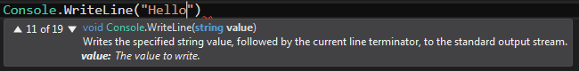

# Argumenten en overloads

In deze code

```
Console.WriteLine("Hallo"); // argument is een string
```

wordt de method `WriteLine` aangeroepen met als argument de string `"Hallo"`.

We spreken van **overloads** als er meerdere methods zijn met **dezelfde naam**
maar met een :

- **ander aantal parameters**
- **parameters met andere types**

B.v. voor `WriteLine` zijn er verschillende **overloads** gedefinieerd.
Je kan `WriteLine` ook aanroepen met een `int` of `double` als argument:

```
Console.WriteLine(3); // argument is een int
Console.WriteLine(4.0); // argument is een double
```

In dit screenshot zie je hoe Visual Studio's IntelliSense de 11e van de 19 
overloads van `Console.WriteLine` slecteert, de overload met een `string`
als argument:


