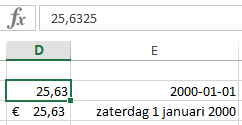
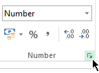
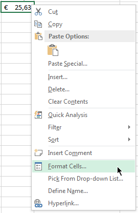
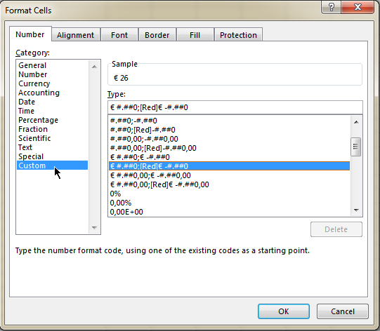

# Cell formatting

Cellen hebben :

- een inhoud (een waarde of een formule)
- een weergave 

Het Cell Formatting dialoogvenster kan geopend worden via het Ribbon:

Of via het context-menu (rechts-klik) van elke cel:

Ook custom format strings zijn mogelijk:

# Further reading

http://www.exceltactics.com/definitive-guide-custom-number-formats-excel/

