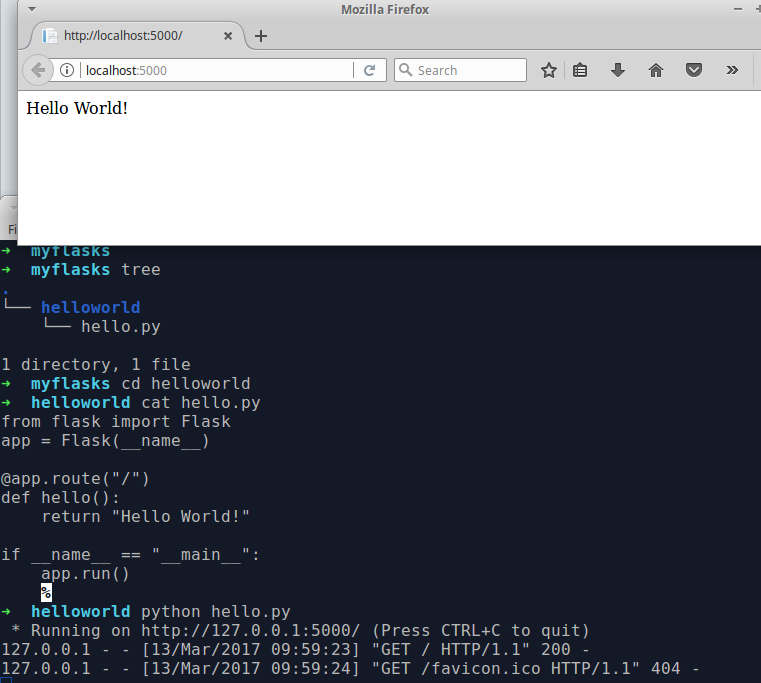

# Flask

## Voorbeeld 1

Het gebruik van een parameter `<username>` zorgt voor
parameters in de URL.

```
from flask import Flask
app = Flask(__name__)

@app.route("/")
def hello():
    return "Hello World!"

@app.route("/zeghallo/<username>")
def zegHallo(username):
    return "<h2>Hallo " + username + "</h2>"

if __name__ == "__main__":
    app.run()
```

## Voorbeeld 2

De static file `index.html` uit de subdir `static` hosten
op de `/`-route:

```
from flask import Flask, url_for

@app.route('/')
def index():
    return redirect(url_for('static', filename='index.html'))
```

## Screenshot


