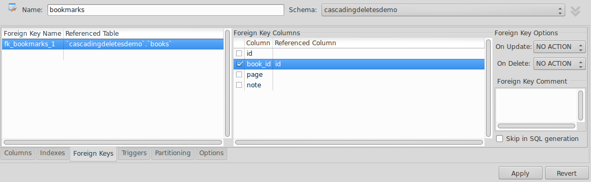

# Cascading deletes demo

## Maken van een schema

```
CREATE DATABASE  IF NOT EXISTS `cascadingdeletesdemo`;
USE `cascadingdeletesdemo`;
```

## Maken van tabellen

Boeken:

```
DROP TABLE IF EXISTS `books`;

CREATE TABLE `books` (
  `id` int(11) NOT NULL,
  `author` varchar(45) DEFAULT NULL,
  `title` varchar(45) DEFAULT NULL,
  PRIMARY KEY (`id`)
);
```

Een boek kan 0 of meer bladwijzers hebben.
Elke bladwijzer behoort bij een paginanummer van het boek.
Op elke bladwijzer kan een korte tekst geschreven worden.

```
DROP TABLE IF EXISTS `bookmarks`;

CREATE TABLE bookmarks (
  `id` 		int(11) 		NOT NULL,
  `book_id` 	int(11) 		NOT NULL,
  `page` 	int(11) 		DEFAULT NULL,
  `note`	varchar(180)		DEFAULT NULL
);
```

Merk op dat we nu enkel de velden (kolommen) hebben gedefinieerd.
Enkel in de tabel `books` is er een extra *CONSTRAINT* gedefinieerd:
de primary key is de kolom `id`.

## AutoIncrement

Het is handig als `books.id` en `bookmarks.id` (de primary keys)
de auto increment constraint hebben. In MySQL doen we dit door
`AUTO_INCREMENT` toe te voegen. Dit kan enkel als het
primary-key-constraint ook al aanwezig is!

De tabellen worden dus:


books:

```
DROP TABLE IF EXISTS `books`;

CREATE TABLE `books` (
  `id` int(11) NOT NULL AUTO_INCREMENT,
  `author` varchar(45) DEFAULT NULL,
  `title` varchar(45) DEFAULT NULL,
  PRIMARY KEY (`id`)
);
```

bookmarks:

```
DROP TABLE IF EXISTS `bookmarks`;

CREATE TABLE books (
  `id` 		int(11) 		NOT NULL	AUTO_INCREMENT,
  `book_id` 	int(11) 		NOT NULL,
  `page` 	int(11) 		DEFAULT NULL,
  `note`	varchar(180)		DEFAULT NULL,
  PRIMARY KEY (`id`)
);
```

> **Let op**: in MySQL wordt een *primary key constraint* achteraan het `CREATE TABLE`-statement toegevoegd.
> In andere dialecten van SQL kan dit soms anders zijn.

## Seeden met data

We maken 2 boeken:

```
INSERT INTO `cascadingdeletesdemo`.`books` (`author`, `title`)
VALUES ('Daniel P. Bovet & Marco Cesati', 'Understanding the Linux Kernel');

INSERT INTO `cascadingdeletesdemo`.`books` (`author`, `title`)
VALUES ('Cay S. Horstmann & Gary Cornell', 'Core Java - Volume 1: Fundamentals');
```

En we voegen enkele bookmarks toe:

```
INSERT INTO bookmarks(book_id, page, note)
VALUES (1, 66, 'BIOS-provided physical addresses map');

INSERT INTO bookmarks(book_id, page, note)
VALUES (2, 114, 'Static Fields and Methods');
```

## Controle

Toon alle bladwijzers van alle boeken:

```
SELECT *
FROM books
JOIN bookmarks 
  ON books.id = bookmarks.book_id;
```

We maken hier gebruik van een primary en foreign key door onze eigen conventies
maar deze worden niet **afgedwongen** door de database, zoals we zodadelijk
zullen zien.

## Boek verwijderen

Uiteraard kunnen we bookmarks gemakkelijk verwijderen
maar wat als we een boek verwijderen?

```
DELETE FROM books
WHERE id = 1;
```

Op het eerste zicht is er niets mis.
Deze query werkt immers correct en returnt slechts 1 boek.

```
SELECT *
FROM books
JOIN bookmarks 
  ON books.id = bookmarks.book_id;
```

Helaas zitten we nu opgezadeld met *orphan*-rijen in
de bookmarks-tabel.

```
SELECT * FROM cascadingdeletesdemo.bookmarks;
```

We kunnen er echter voor zorgen dat de database intern consistent blijft
door de tabellen beter te configureren zodat MySQL op de hoogte is van
de relaties. Dit gebeurt met *indexes* en *foreign key constraints*.

## Boek opnieuw toevoegen

Voor het verdere experiment, moeten we het boek terug toevoegen.

```
INSERT INTO books(author, title)
VALUES('Daniel P. Bovet & Marco Cesati', 'Understanding the Linux Kernel');
```

Bij de controle zien we dat het *AUTO_INCREMENT* id is verhoogd naar 3
en niet meer het originele 1.

```
SELECT * FROM cascadingdeletesdemo.books;
```

Bijgevolg hebben we nog steeds *orphan*-bookmarks.

Verwijder dus best deze rij en voeg het opnieuw toe, ditmaal **expliciet**
het juiste `id` ingevend.

```
DELETE FROM books
WHERE id=3;

INSERT INTO books(id, author, title)
VALUES(1, 'Daniel P. Bovet & Marco Cesati', 'Understanding the Linux Kernel');
```

> Opgelet dus met auto_increment! MySQL blijft verder tellen, ook na
verwijderde rijen.

## Cascading deletes: tabellen configureren

Dit kan beter!

Telkens we een boek verwijderen, willen we ook alle bijhorende bookmarks
verwijderen : **cascading deletes**.

We moeten hiervoor extra constraints toevoegen bij het maken van de tabellen,
zodat MySQL op de hoogte is van de relaties tussen de tabellen.
We willen m.a.w. **referentiele integriteit**.

Voordien hadden we slechts **impliciete** relaties, door weldoordachte veldnamen
(`books.id` als PK en `bookmarks.book_id` als FK).

Dit kunnen we ook in MySQL Workbench doen met **Alter Table** v.d. tabel `bookmarks`.

In het tab-blad **Foreign Keys** kunnen we:

- dubbelklikken om een foreign key te maken
- de *referenced table* kiezen (`books`)
- de kolom `book_id` aan te duiden als **reference column** voor `books.id`



Deze SQL-code zal uitgevoerd worden na **Apply**:

```
ALTER TABLE `cascadingdeletesdemo`.`bookmarks` 
ADD CONSTRAINT `fk_bookmarks_1`
  FOREIGN KEY (`book_id`)
  REFERENCES `cascadingdeletesdemo`.`books` (`id`)
  ON DELETE CASCADE
  ON UPDATE CASCADE;
```

Als je nu gaat kijken in het tabblad **Indexes**, zal je zien dat er automatisch
een index `fk_bookmarks_1_idx` aangemaakt is.

> Indexes worden normaal gebruikt om zoekopdrachten met bepaalde kolommen sneller te laten gaan.
> In het geval expliciet een kolom als foreign key wordt aangeduid, worden de bijhorende
> Indexes automatisch door MySQL beheerd.

Stel dat we de tabel in 1 keer zouden willen maken met de foreign key en de cascade instellingen:

```
CREATE TABLE `bookmarks` (
  `id` int(11) NOT NULL AUTO_INCREMENT,
  `book_id` int(11) NOT NULL,
  `page` int(11) DEFAULT NULL,
  `note` varchar(180) DEFAULT NULL,
  PRIMARY KEY (`id`),
  KEY `fk_bookmarks_1_idx` (`book_id`),
  CONSTRAINT `fk_bookmarks_1` 
    FOREIGN KEY (`book_id`) 
    REFERENCES `books` (`id`) 
    ON DELETE CASCADE
    ON UPDATE CASCADE
);
```

## Cascading deletes : uitproberen

Zorg ervoor dat je database dezelfde begindata bevat, d.w.z. :

- 2 books
- 2 bookmarks
- let er eventueel op of de id's beginnen te tellen vanaf 1 (o.w.v. auto-increment en eerder verwijderde rijen)

Probeer nu 1 boek te verwijderen.

Als cascading deletes werken, zouden automatisch de bijhorende bookmarks moeten verwijderd zijn.

```
DELETE FROM books
WHERE id IN (2);
```

Controleer:

```
SELECT * FROM books;
SELECT * FROM bookmarks;
```

## Cascading updates

We hebben ook **cascading updates** aangezet.

Dit wil dus zeggen dat als we een veld updaten waar 1 of meerdere refererende (foreign) key **expliciet**
(met een `foreign key constraint`) naar zo'n veld verwijzen, deze rijen ook zullen aangepast worden.

Het veld `books.id` is zo'n veld waar een foreign key constraint op rust in de tabel `bookmarks`.

Update het:

```
UPDATE books
SET id = 101
WHERE id = 1;
```

En controleer of in `bookmarks` het `book_id` ook veranderd is:

```
SELECT * FROM cascadingdeletesdemo.books;
```

## Controle: verwijder constraints

Om ons er van te vergewissen dat referentiele integriteit echt word afgedwongen
door het **foreign key constraint** (en de bijhorende automatisch gemaakte **index**),
verwijderen we deze.

Dit kan in de MySQL Workbench GUI met **alter table** (rechts-klik op de FK en *delete selected*) of met:

```
ALTER TABLE `cascadingdeletesdemo`.`bookmarks` 
DROP FOREIGN KEY `fk_bookmarks_1`;
ALTER TABLE `cascadingdeletesdemo`.`bookmarks` 
DROP INDEX `fk_bookmarks_1_idx` ;
```

> We moeten ook de automatisch aangemaakte index verwijderen, tenzij die nog door andere FK-constraints zou gebruikt worden.
> De namen van de foreign key en de index kunnen natuurlijk anders zijn.

Verander nu terug het `id` van een boek:

```
UPDATE books
SET id = 101
WHERE id = 202;
```

Je zou nu moeten zien dat we MySQL **geen referentiele integriteit** meer laten afdwingen: 
de bookmarks-tabel is **niet** mee aangepast:

```
SELECT * FROM bookmarks;
```

## Appendix

De volledige database met auto-increment en cascading deletes:

```
CREATE DATABASE  IF NOT EXISTS `cascadingdeletesdemo`;
USE `cascadingdeletesdemo`;

CREATE TABLE `books` (
  `id` int(11) NOT NULL AUTO_INCREMENT,
  `author` varchar(45) DEFAULT NULL,
  `title` varchar(45) DEFAULT NULL,
  PRIMARY KEY (`id`)
);

CREATE TABLE `bookmarks` (
  `id` int(11) NOT NULL AUTO_INCREMENT,
  `book_id` int(11) NOT NULL,
  `page` int(11) DEFAULT NULL,
  `note` varchar(180) DEFAULT NULL,
  PRIMARY KEY (`id`),
  KEY `fk_bookmarks_1_idx` (book_id),
  CONSTRAINT `fk_bookmarks_1` 
    FOREIGN KEY (book_id) 
    REFERENCES books (id) 
    ON DELETE CASCADE
    ON UPDATE CASCADE
);

INSERT INTO books (author, title)
VALUES ('Daniel P. Bovet & Marco Cesati', 'Understanding the Linux Kernel');

INSERT INTO books (author, title)
VALUES ('Cay S. Horstmann & Gary Cornell', 'Core Java - Volume 1: Fundamentals');

INSERT INTO bookmarks(book_id, page, note)
VALUES (1, 66, 'BIOS-provided physical addresses map');

INSERT INTO bookmarks(book_id, page, note)
VALUES (2, 114, 'Static Fields and Methods');
```

## Experiment: RESTRICT i.p.v. CASCASE

Voer volgende query uit:

```
ALTER TABLE `cascadingdeletesdemo`.`bookmarks` 
DROP FOREIGN KEY `fk_bookmarks_1`;
ALTER TABLE `cascadingdeletesdemo`.`bookmarks` 
ADD CONSTRAINT `fk_bookmarks_1`
  FOREIGN KEY (`book_id`)
  REFERENCES `cascadingdeletesdemo`.`books` (`id`)
  ON DELETE RESTRICT
  ON UPDATE RESTRICT;
```

Probeer nu een boek te verwijderen. Wat zie je?

**Conclusie**: referentiele integriteit wordt nu afgedwongen door een foutmelding.
Je moet eerst de relevante rijen in de refererende tabel verwijderen, vooraleer je
een rij in de *parent table* kan verwijderen.
